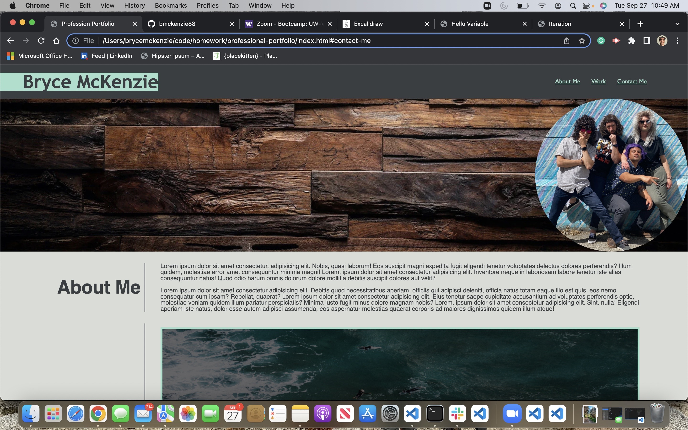

# Professional-Portfolio
This repo is for a professional portfolio where I will highlight my strongest work as well as the thought process behind it.

## Description

The purpose of this challenge was to create a responsive website that applies what we have learned about flexboxes, media queries, and CSS, while continuing to to use best practices regarding HTML and CSS formatting.

## Installation

N/A

## Usage

To use this website, you can navigate the page via scrolling or click one of the links in the top nav bar to jump to one of the three sections of the page. 

URL: https://bmckenzie88.github.io/professional-portfolio/

## Credits

N/A

## License

Please refer to the LICENSE in the repo.